<h2>TensorFlow-FlexUNet-Image-Segmentation-BUSCot-Breast-Cancer (2026/08/17)</h2>
<h3>BUSCot Breast Cancer: AI Generated Pseudo Masks Segmentation Challenge</h3>
Sarah T.  Arai 
Software Laboratory antillia.com  
This is the second experiment of Image Segmentation for <b>BUSCot</b> based on our <a href="./src/TensorFlowFlexUNet.py">TensorFlowFlexUNet</a> 
(TensorFlow Flexible UNet Image Segmentation Model for Multiclass), 
and a 512x512 pixels upscaled 
<a href="https://drive.google.com/file/d/1KoNKtZHVxBKNJRNhG6mehM2N8n2GI9Ua/view?usp=sharing">
<b>BUSCot-ImageMask-Dataset.zip</b></a> with colorized masks (<a href="https://www.mit.edu/~amini/LICENSE.md">MIT</a>) 
which was derived by us from   
<a href="https://www.kaggle.com/datasets/iftekharahmmed/buscot-dataset">
<b>BUSCoT Dataset</b> </a> by Iftekhar Ahmmed.
  

<b>Actual Image Segmentation for BUSCot Images of 512x512 pixels</b> 
As shown below, the inferred masks predicted by our segmentation model trained by the dataset appear similar to the ground truth masks.
  
<b>rgb_map = {benign:green, malignant:red}</b>
  
<table>
<tr>
<th>Input: image</th>
<th>Mask (ground_truth)</th>
<th>Prediction: inferred_mask</th>
</tr>
<tr>
<td>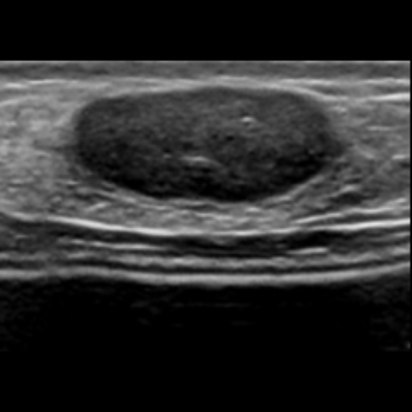</td>
<td>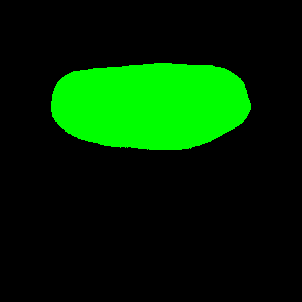</td>
<td>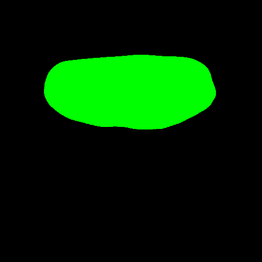</td>
</tr>

<tr>
<td>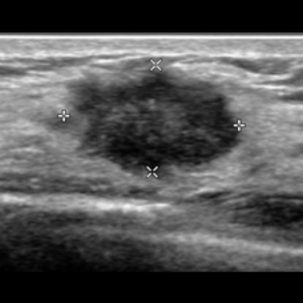</td>
<td>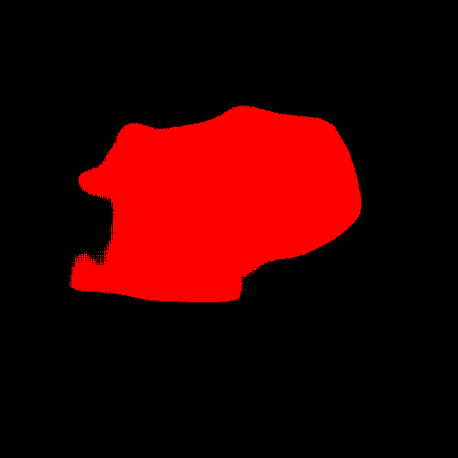</td>
<td>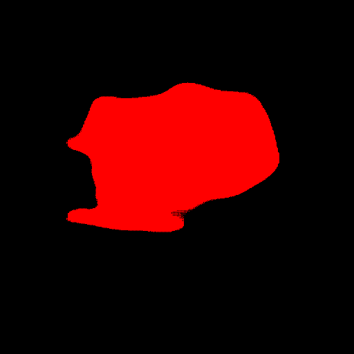</td>
</tr>

<tr>
<td>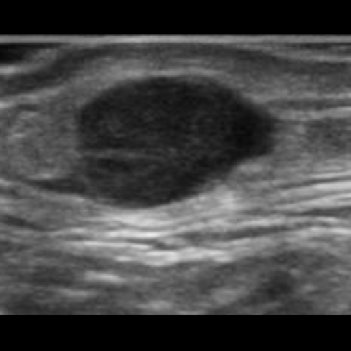</td>
<td>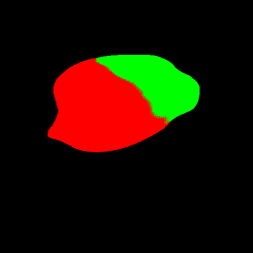</td>
<td>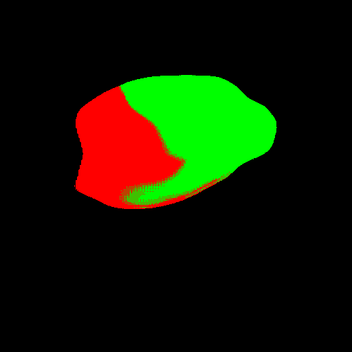</td>
</tr>
</table>

 
<h3>1  Dataset Citation</h3>
The dataset used here was derived from    
<a href="https://www.kaggle.com/datasets/iftekharahmmed/buscot-dataset">
<b>BUSCoT Dataset</b> </a> by Iftekhar Ahmmed.
  
The following explanation (excerpt) was taken from the website above.
  

<b>About Dataset</b> 
<b>
A Chain-of-thought Reasoning
Breast Ultrasound Dataset Covering
All Histopathology Categories</b> 
HaojunYu, Youcheng Li, Zihan Niu, NanZhang, XuantongGong,Huan Li, ZhiyingZou, HaifengQi, 
ZhenxiaoCao, Zijie Lan, XingjianYuan,Jiating He, Haokai Zhang, ShengtaoZhang, ZichengWang, 
DongWang, ZiweiZhao,CongyingChen, YongWang, WangyanQin, Qingli Zhu & LiweiWang 
 
Breast ultrasound (BUS) is an essential tool for diagnosing breast lesions, with millions of examinations 
per year. However, publicly available high-quality BUS benchmarks for AI development are limited
in data scale and annotation richness.   
In this work, we present BUS-CoT, a BUS dataset for chainof-thought (CoT) reasoning analysis, 
which contains 11,439 ultrasound images from 11,850 lesions
and 4,838 patients, covering all 99 WHO-defined histopathology categories. 
 For model training and
evaluation, we provide a curated high-quality subset of 5,163 lesion-focused images annotated by
experienced radiologists. To facilitate research on incentivizing CoT reasoning, we construct the
reasoning processes based on observation, feature, diagnosis and pathology labels, annotated and
verified by experienced experts. Moreover, by covering lesions of all histopathology types, we aim to
facilitate robust AI systems in rare cases, which can be error-prone in clinical practice.  
 
The data and codeare publicly available at <a href="https://doi.org/10.6084/m9.figshare.30838715">
https://doi.org/10.6084/m9.figshare.30838715</a>.
  
<b>Background & Summary</b> 
Breast cancer remains a significant threat to women’s health, causing more than 670,000 deaths per year1–4
 
Accurate diagnosis of breast cancer based on medical images is crucial to improving prognosis. In developing
countries, ultrasound has become an essential imaging tool for breast lesion diagnosis due to its cost efficiency,
portability, noninvasiveness, and high sensitivity for younger women or dense breasts
. In China, more than 12
million breast ultrasound examinations are performed annually6
.
 
However, accurately interpreting breast ultrasound findings is challenging. For suspicious cases,
evidence-based diagnostic reasoning as described in the Users’ Guides to the Medical Literature, Chapter 16:
 
The Process of Diagnosis7
, and breast imaging guidelines such as BI-RADS (Chapter 3: Ultrasound Lexicon)
,
recommend physicians employ systematic chain-of-thought (CoT) reasoning - evaluating features like margins, 
echo patterns, and calcifications to estimate the probability of potential diagnoses.
While breast ultrasound (BUS) AI systems have demonstrated remarkable success, they currently cannot
provide this nuanced reasoning process. This limitation restricts their capacity to analyze challenging cases
thoroughly. 
Moreover, this lack of interpretability remains a significant gap in real-world applications. A single-blind randomized trial9
revealed that although the AI achieved high diagnostic accuracy (92%), diagnosticians assisted
  
<b>License</b> 
<a href="https://www.mit.edu/~amini/LICENSE.md">MIT</a>  
For more information, please refer to <a href="https://www.nature.com/articles/s41597-026-06702-9"><b>
A Chain-of-thought Reasoning Breast Ultrasound Dataset Covering All Histopathology Categories</b></a> 
 
 
<h3>
2 BUSCot ImageMask Dataset
</h3>
<h3>
2.1 Download ImageMask Dataset
</h3>
 If you would like to train this BUSCot Segmentation model by yourself,
please down load our dataset 
 <a href="https://drive.google.com/file/d/1KoNKtZHVxBKNJRNhG6mehM2N8n2GI9Ua/view?usp=sharing">
<b>BUSCot-ImageMask-Dataset.zip</b></a>
 (<a href="https://www.mit.edu/~amini/LICENSE.md">MIT</a>), expand the downloaded, and put it under <b>./dataset/</b> to be:
<pre>
./dataset
└─BUSCot
    ├─test
    │   ├─images
    │   └─masks
    ├─train
    │   ├─images
    │   └─masks
    └─valid
        ├─images
        └─masks
</pre>
<b>BUSCot Statistics</b> 
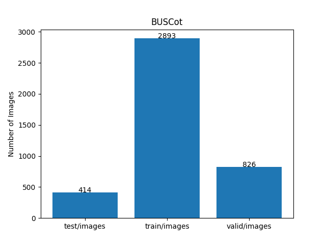 
 
As shown above, the number of images of train and valid datasets is large enough to use for a training set of our segmentation model.
  
<h3>
2.2 Derivation of ImageMask Dataset
</h3>
The folder structure of the original dataset is as follows, but it contains no annotation (mask) files because it is 
an image classification dataset.
<pre>
./BUSCot
  ├─Benign
  │   ├─000000@0.png
,,,
  │   └─008942@0.png
  │  
  └─Malignant
       ├─000023@0.png
...
       └─009450@0.png
</pre>
<b>Step 1</b> 
We generated a 512x512 pixels upscaled mixed master images from all PNG image files  
in <b>Benign</b> and <b>Malignant</b> subfolders of BUSCot..
  
<b>Step 2</b> 
We generated the first pseudo colorized masks (Benign: green and Malignant: red) corresponding to the master images by applying 
a segmentation (inference) method of a pretrained FlexUNet model
<a href="https://github.com/sarah-antillia/TensorFlow-FlexUNet-Image-Segmentation-BUSI-Breast-Cancer">
TensorFlow-FlexUNet-Image-Segmentation-BUSI-Breast-Cancer
</a> to all master images.
  
<b>Step 3</b> 
We generated the first ImageMask Dataset 
from all pairs of the first pseudo masks and their corresponding master images.
to green.
  
<b>Step 4</b> 
We generated the second pseudo masks corresponding to the master images by applying 
a segmentation (inference) method of a FlexUNet Model 
<a href="https://github.com/sarah-antillia/TensorFlow-FlexUNet-Image-Segmentation-Model">TensorFlow-FlexUNet-Image-Segmentation-Model</a>  
trained by the first ImageMask Dataset.
 
 
<b>Step 5</b> 
We generated the second ImageMask Dataset from all pairs of the second pseudo masks and their corresponding master images.
 
 
<b>Step 6</b> 
We generated the third pseudo masks corresponding to the master images by applying 
a segmentation (inference) method of a FlexUNet Model 
<a href="https://github.com/sarah-antillia/TensorFlow-FlexUNet-Image-Segmentation-Model">TensorFlow-FlexUNet-Image-Segmentation-Model</a> 
trained by the second ImageMask Dataset.
 
 
<b>Step 7</b> 
We finally generated our own <a href="https://drive.google.com/file/d/1KoNKtZHVxBKNJRNhG6mehM2N8n2GI9Ua/view?usp=sharing"><b>BUSCot-ImageMask-Dataset</b></a> from 
all pairs of the third pseudo masks and their corresponding master images.
  
<h3>
2.3 Train Sample Images and Masks
</h3>
<b>Train_sample images</b> 
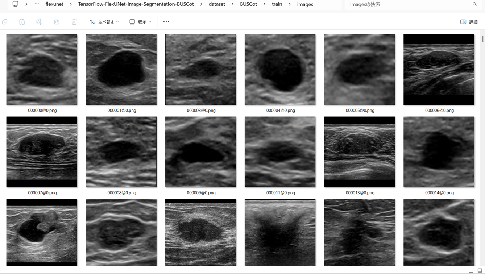
 
<b>Train_sample_masks</b> 
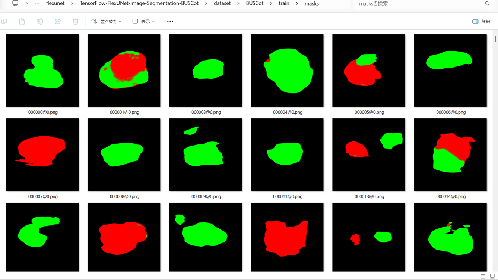
 
<h3>
3 Train TensorFlowFlexUNet Model
</h3>
 We trained the BUSCot TensorflowFlexUNet Model by using the following
<a href="./projects/TensorFlowFlexUNet/BUSCot/train_eval_infer.config"> <b>train_eval_infer.config</b></a> file.  
Please move to ./projects/TensorFlowFlexUNet/BUSCot and run the following bat file. 
<pre>
>1.train.bat
</pre>
which simply runs the following command. 
<pre>
>python ../../../src/TensorFlowFlexUNetTrainer.py ./train_eval_infer.config
</pre>

<b>Model parameters</b> 
Defined a small <b>base_filters=16</b> and a large <b>base_kernels=(11,11)</b> for the first Conv Layer of Encoder Block of 
<a href="./src/TensorFlowFlexUNet.py">TensorFlowFlexUNet.py</a> 
and a large num_layers (including a bridge between Encoder and Decoder Blocks).
<pre>
[model]
image_width    = 512
image_height   = 512
image_channels = 3
input_normalize = True
normalization  = False
num_classes    = 3
base_filters   = 16
base_kernels  = (11,11)
num_layers    = 8
dropout_rate   = 0.05
dilation       = (1,1)
</pre>
<b>Learning rate</b> 
Defined a small learning rate.  
<pre>
[model]
learning_rate  = 0.00007
</pre>
<b>Loss and metrics functions</b> 
Specified "categorical_crossentropy" and "dice_coef_multiclass". 
<pre>
[model]
loss           = "categorical_crossentropy"
metrics        = ["dice_coef_multiclass"]
</pre>
<b >Learning rate reducer callback</b> 
Enabled learning_rate_reducer callback, and a small reducer_patience.
<pre> 
[train]
learning_rate_reducer = True
reducer_factor     = 0.5
reducer_patience   = 4
</pre>
<b>Early stopping callback</b> 
Enabled early stopping callback with patience parameter.
<pre>
[train]
patience      = 10
</pre>
<b></b> 
<b>RGB color map</b> 
rgb color map dict for BUSCot 1+2 classes. 
<pre>
[mask]
mask_file_format = ".png"
;BUSCot 1+2
rgb_map = {(0,0,0):0,(0,255,0):1,(255,0,0):2,}
</pre>
<b>Epoch change inference callbacks</b> 
Enabled epoch_change_infer callback. 
<pre>
[train]
epoch_change_infer       = True
epoch_change_infer_dir   =  "./epoch_change_infer"
epoch_changeinfer        = False
epoch_changeinfer_dir    = "./epoch_changeinfer"
num_infer_images         = 6
</pre>
By using this epoch_change_infer callback, on every epoch_change, the inference procedure can be called
 for 6 images in <b>mini_test</b> folder. This will help you confirm how the predicted mask changes 
 at each epoch during your training process.    
<b>Epoch_change_inference output at starting (1,2,3)</b> 
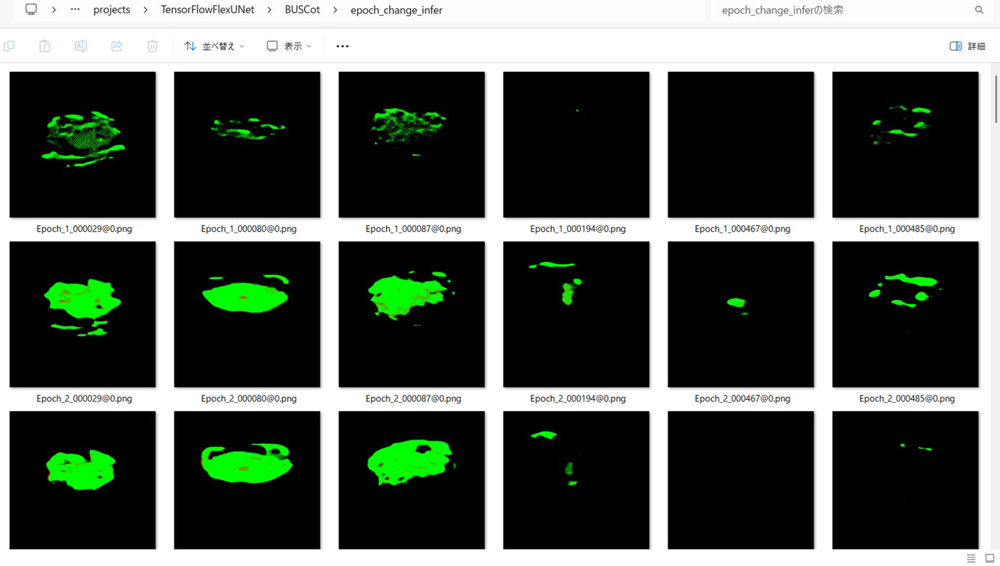 
 
<b>Epoch_change_inference output at middle-point (12,13,14)</b> 
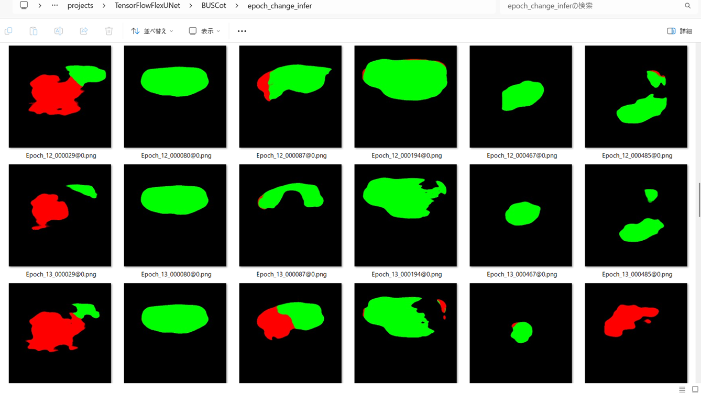 
 
<b>Epoch_change_inference output at ending (25,26,27)</b> 
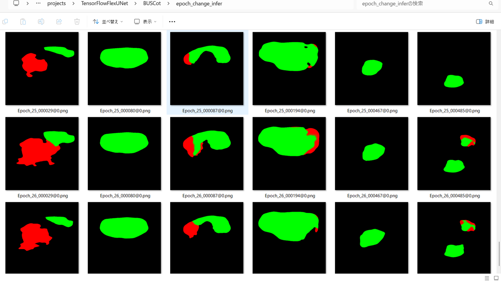 
 
In this experiment, the training process was stopped at epoch 27 by EarlyStoppingCallback.  
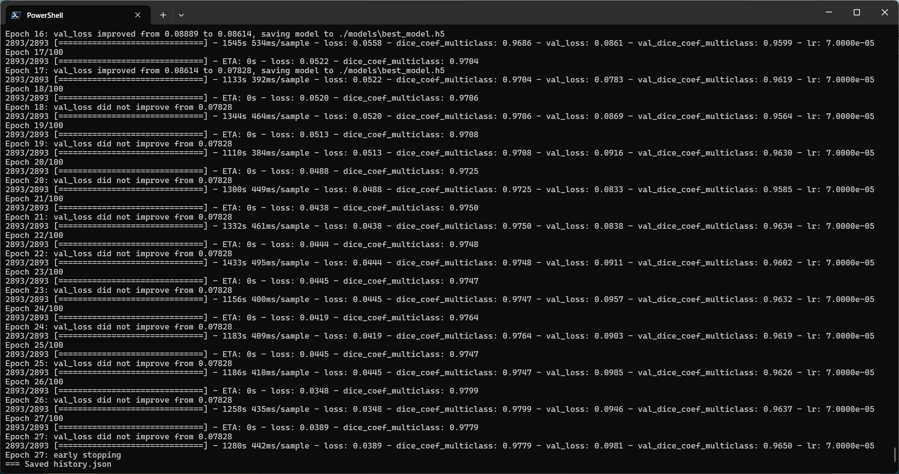 
 
<a href="./projects/TensorFlowFlexUNet/BUSCot/eval/train_metrics.csv">train_metrics.csv</a> 
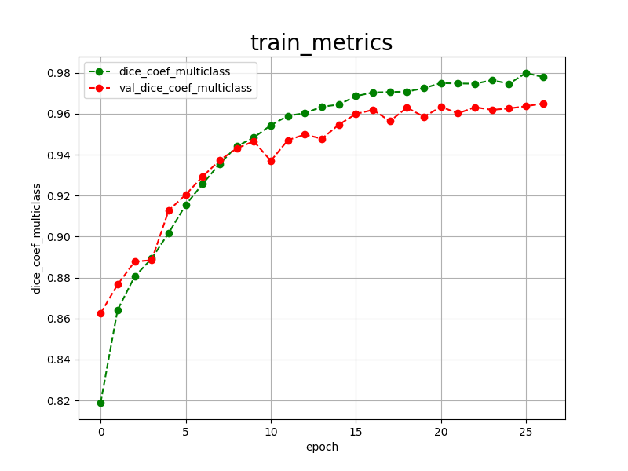 
 
<a href="./projects/TensorFlowFlexUNet/BUSCot/eval/train_losses.csv">train_losses.csv</a> 
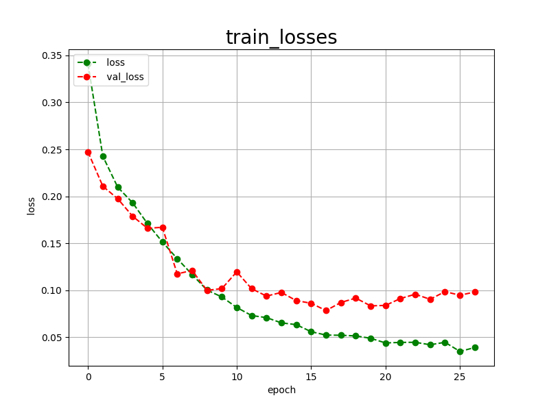 
 
<h3>
4 Evaluation
</h3>
Please move to <b>./projects/TensorFlowFlexUNet/BUSCot</b> folder and run the following bat file to evaluate TensorflowFlexUNet model for BUSCot. 
<pre>
>./2.evaluate.bat
</pre>
This bat file simply runs the following command.
<pre>
>python ../../../src/TensorFlowFlexUNetEvaluator.py  ./train_eval_infer.config
</pre>
Evaluation console output: 
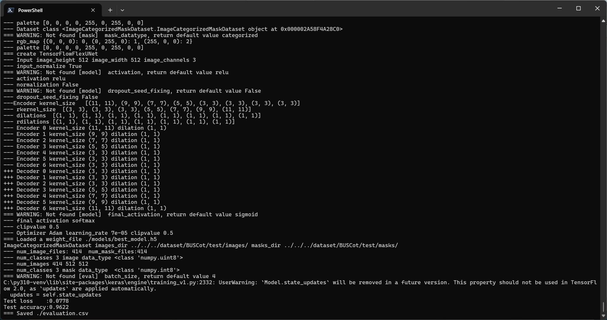
  Image-Segmentation-BUSCot
<a href="./projects/TensorFlowFlexUNet/BUSCot/evaluation.csv">evaluation.csv</a> 
The loss (categorical_crossentropy) to this BUSCot/test was not low, and dice_coef_multiclass not high as shown below.
 
<pre>
categorical_crossentropy,0.0778
dice_coef_multiclass,0.9622
</pre>

 
<h3>
5 Inference
</h3>
Please move to  <b>./projects/TensorFlowFlexUNet/BUSCot</b> folder, and run the following bat file to infer segmentation regions for images by the Trained-TensorFlowFlexUNet model for BUSCot. 
<pre>
>./3.infer.bat
</pre>
This simply runs the following command.
<pre>
>python ../../../src/TensorFlowFlexUNetInferencer.py ./train_eval_infer.config
</pre>

<b>mini_test_images</b> 
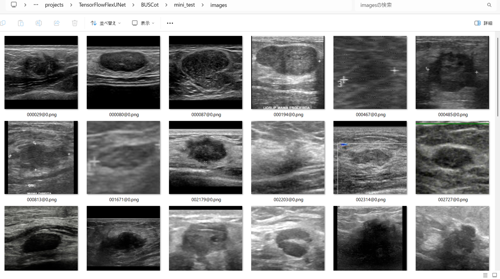 
<b>mini_test_mask(ground_truth)</b> 
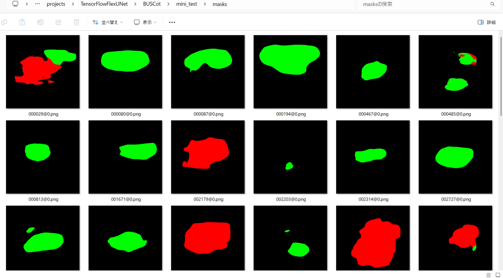 

<b>Inferred test masks</b> 
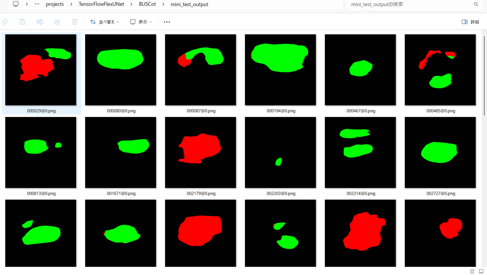 
 

<b>Enlarged images and masks for  BUSCot Images</b> 
As shown below, the inferred masks predicted by our segmentation model trained by the dataset appear similar to the ground truth masks
except the first and third cases.
  
<b>rgb_map = {benign:green, malignant:red}</b>
 
 
<table>
<tr>
<th>Input: image</th>
<th>Mask (ground_truth)</th>
<th>Prediction: inferred_mask</th>
</tr>
<tr>
<td>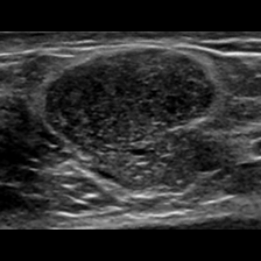</td>
<td>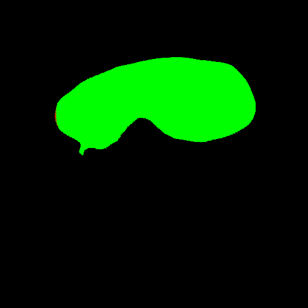</td>
<td>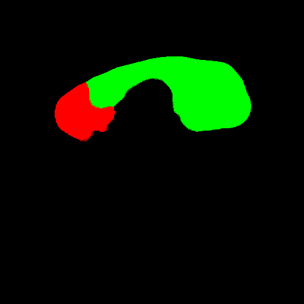</td>
</tr>

<tr>
<td>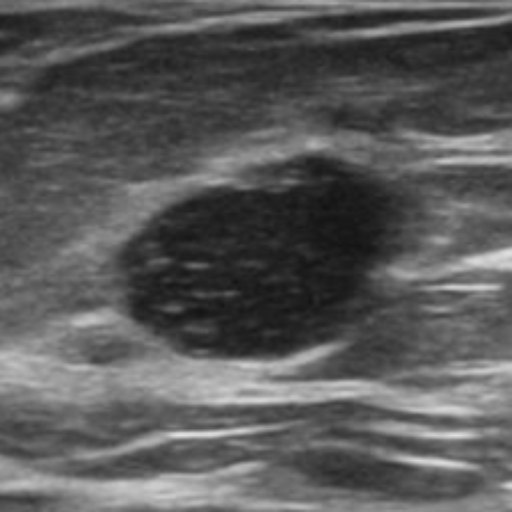</td>
<td>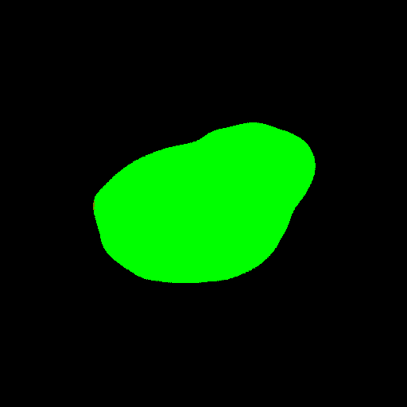</td>
<td>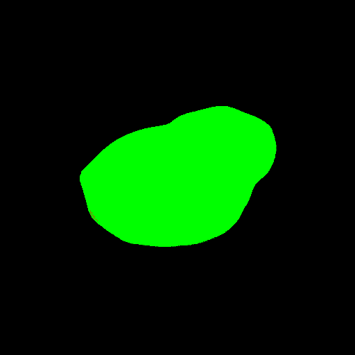</td>
</tr>

<tr>
<td>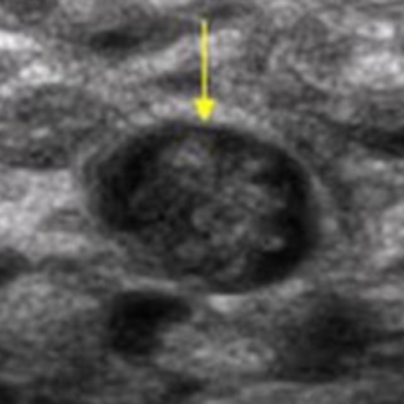</td>
<td>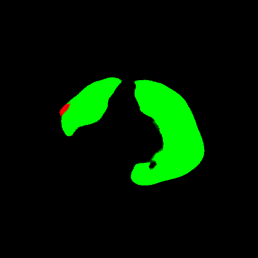</td>
<td>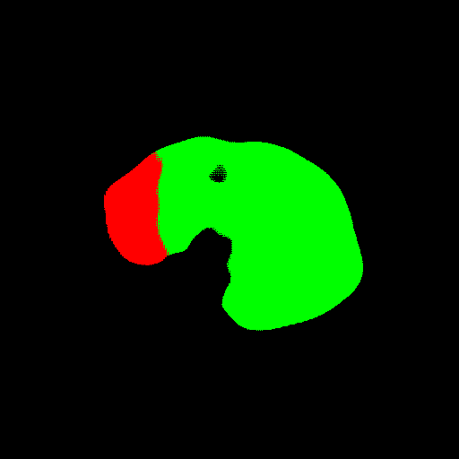</td>
</tr>
<tr>
<td>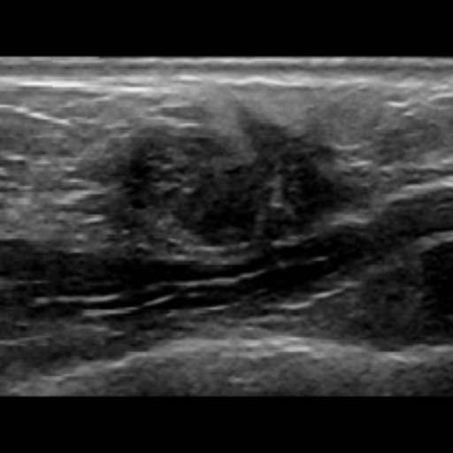</td>
<td>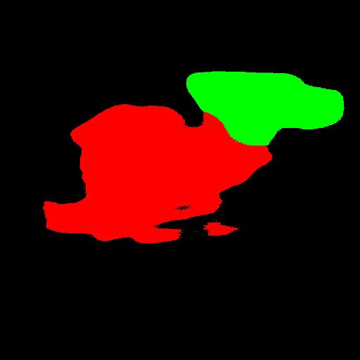</td>
<td>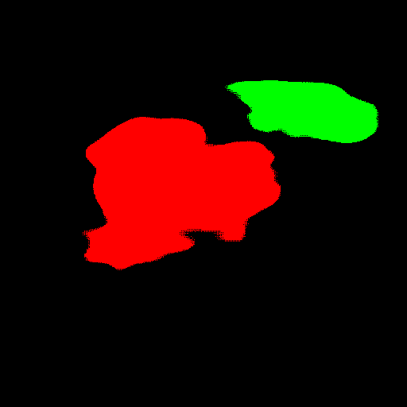</td>
</tr>
<tr>
<td>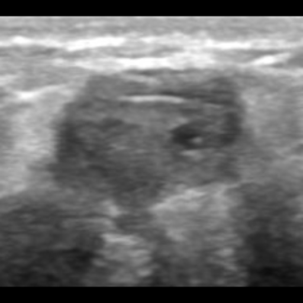</td>
<td></td>
<td></td>
</tr>
<tr>
<td></td>
<td></td>
<td></td>
</tr>
</table>

 
<h3>
References
</h3>
<b>1. A Chain-of-thought Reasoning Breast Ultrasound Dataset Covering All Histopathology Categories</b> 
Haojun Yu, Youcheng Li, Zihan Niu, Nan Zhang, Xuantong Gong, Huan Li, Zhiying Zou, Haifeng Qi, 
 Zhenxiao Cao, Zijie Lan, Xingjian Yuan, Jiating He, Haokai Zhang, Shengtao Zhang, Zicheng Wang,  
 Dong Wang, Ziwei Zhao, Congying Chen, Yong Wang, Wangyan Qin, Qingli Zhu & Liwei Wang 
<a href="https://www.nature.com/articles/s41597-026-06702-9">
https://www.nature.com/articles/s41597-026-06702-9</a>
  
<b>2. Breast lesion detection using an anchor-free network from ultrasound images with segmentation-based enhancement</b> 
Yu Wang & Yudong Yao 
<a href="https://www.nature.com/articles/s41598-022-18747-y">
https://www.nature.com/articles/s41598-022-18747-y
</a>
 
 
<b>3. Classification of Breast Cancer Ultrasound Images with Deep Learning-Based Models </b> 
Fatih Uysa,and Mehmet Murat Köse 
<a href="https://www.mdpi.com/2673-4591/31/1/8/html">
https://www.mdpi.com/2673-4591/31/1/8/html
</a>
 
 
<b>4. A CNN Deep Learning Technique for Prediction of Breast Cancer using Ultrasound Image
</b> 
Atisham Khan and Silky Pareyani 
<a href="https://www.jetir.org/papers/JETIR2303813.pdf">
https://www.jetir.org/papers/JETIR2303813.pdf
</a>
 
 
<b>5. TensorFlow-FlexUNet-Image-Segmentation-BUSI-Breast-Cancer</b> 
Toshiyuki Arai  
<a href="https://github.com/sarah-antillia/TensorFlow-FlexUNet-Image-Segmentation-BUSI-Breast-Cancer">
https://github.com/sarah-antillia/TensorFlow-FlexUNet-Image-Segmentation-BUSI-Breast-Cancer
</a>
  

<b>6. TensorFlow-FlexUNet-Image-Segmentation-BUS-BRA</b> 
Toshiyuki Arai  
<a href="https://github.com/sarah-antillia/TensorFlow-FlexUNet-Image-Segmentation-BUS-BRA">
https://github.com/sarah-antillia/TensorFlow-FlexUNet-Image-Segmentation-BUS-BRA
</a>
  

<b>7. TensorFlow-FlexUNet-Image-Segmentation-BUS-UC</b> 
Toshiyuki Arai @antillia.com 
<a href="https://github.com/sarah-antillia/TensorFlow-FlexUNet-Image-Segmentation-BUS-UC">
https://github.com/sarah-antillia/TensorFlow-FlexUNet-Image-Segmentation-BUS-UC</a>
 
 
<b>8. TensorFlow-FlexUNet-Image-Segmentation-Model</b> 
Toshiyuki Arai  
<a href="https://github.com/sarah-antillia/TensorFlow-FlexUNet-Image-Segmentation-Model">
https://github.com/sarah-antillia/TensorFlow-FlexUNet-Image-Segmentation-Model
</a>
 
 
